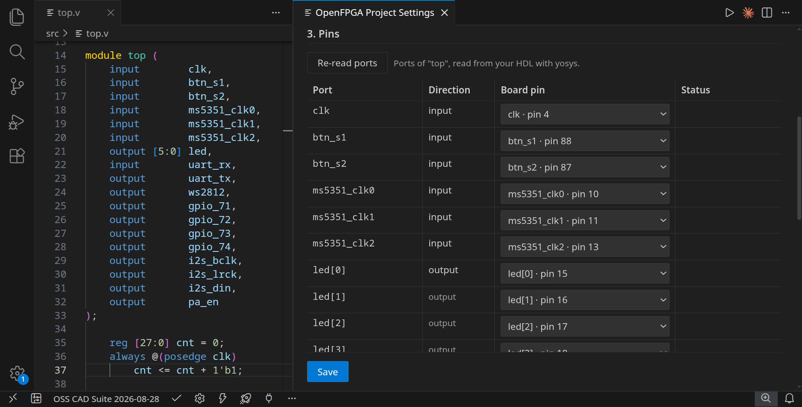
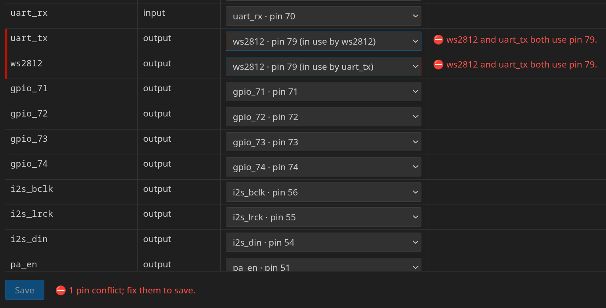
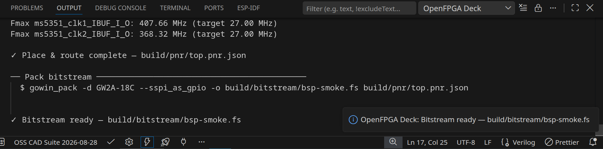
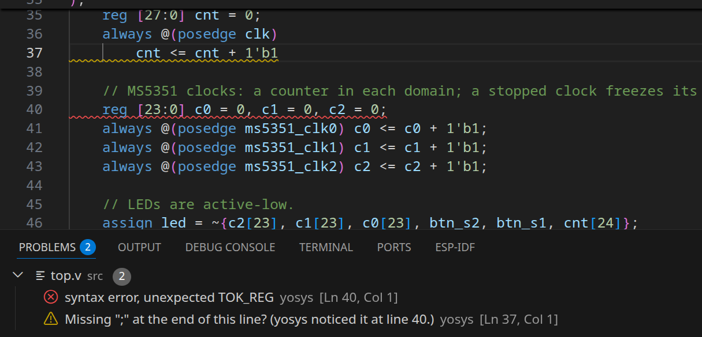
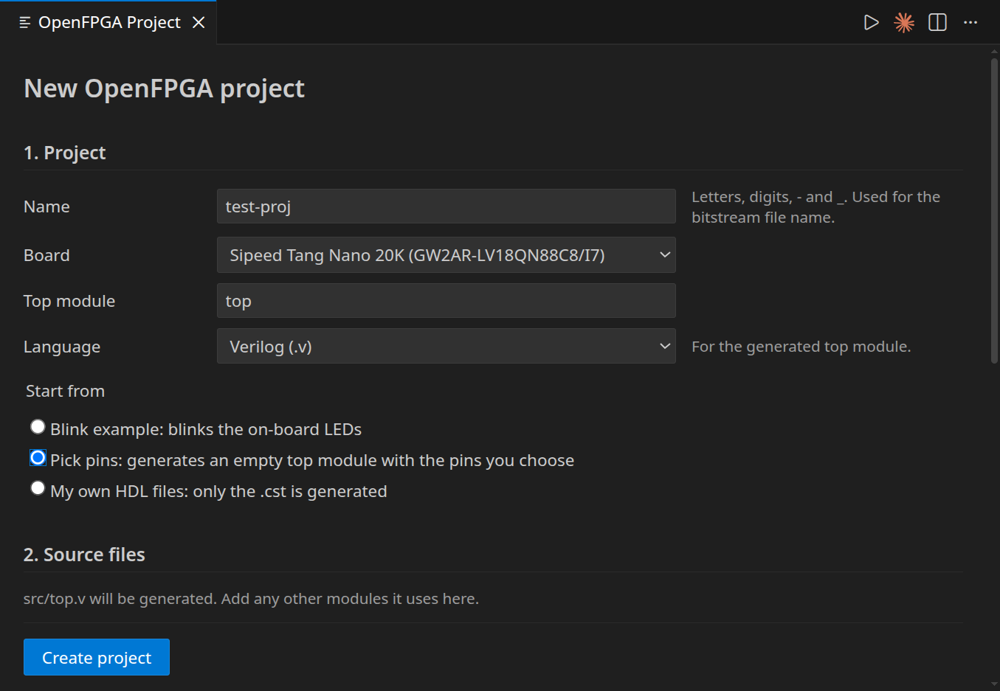
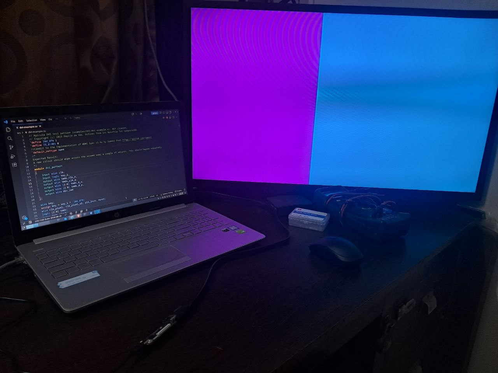

# OpenFPGA Deck

Take an FPGA design from HDL to a running board without leaving VS Code,
using the open-source [YosysHQ OSS CAD Suite](https://github.com/YosysHQ/oss-cad-suite-build).

```
HDL → Synthesize (Yosys) → Place & Route (nextpnr) → Pack (gowin_pack) → Program (openFPGALoader)
```



## Supported

| | |
| --- | --- |
| **Board** | Sipeed Tang Nano 20K (Gowin GW2AR-LV18QN88C8/I7) |
| **OS** | Linux x64 (the only platform it is tested on) |
| **HDL** | Verilog and SystemVerilog (VHDL is not supported yet) |
| **Toolchain** | OSS CAD Suite; tested with release 2026-08-28 |
| **VS Code** | 1.85 or newer |

## Features

- **Project Settings panel.** Create a project and edit it later from one
  page: name, board, top module, source files, pins and toolchain. Start
  from a blink example, from board pins you pick (the top module is
  generated), or from your own HDL (its ports are read with yosys).
- **Pin mapping with checks.** Map each port to a board pin, chosen from a
  list grouped by peripheral (LEDs, buttons, UART, HDMI, …). Pins used
  twice, unknown pins and direction mismatches are flagged, and Save is
  blocked until conflicts are fixed. The `.cst` is generated from the
  mapping; if Save would change an existing `.cst`, you see a diff first.

  

- **One-click build.** Synthesize, place and route, and pack, one stage at a
  time or all with **Build**. Only stages whose inputs changed are re-run.
  Output streams to the *OpenFPGA Deck* output channel, with a utilisation
  and Fmax summary after place and route; full logs go to `build/logs/`.

  

- **Errors in the Problems panel.** Synthesis, place-and-route and packing
  errors point at the HDL line or at the `.cst` line of the port involved.

  

- **Programming.** Load the bitstream into SRAM (lost at power-off) or
  flash (kept). Before a flash write, the extension offers to back up the
  current flash contents to `build/backup/`. **Write File to Board** writes
  any `.fs` bitstream or `.bin` image, for example to restore a backup.
- **Toolchain management.** Finds an existing OSS CAD Suite, or downloads a
  release from the official GitHub repository and checks its integrity.
  Releases are kept side by side; switch between them or check for a newer
  one from the panel.

## Install

1. Install **OpenFPGA Deck** from the Extensions view (search "OpenFPGA
   Deck").
2. **USB access to the board.** openFPGALoader needs permission to open the
   Tang Nano 20K's USB programmer. Install its udev rules once and add
   yourself to the `plugdev` group:

   ```sh
   sudo groupadd --system plugdev   # "already exists" is fine
   sudo curl -fsSL -o /etc/udev/rules.d/99-openfpgaloader.rules \
     https://raw.githubusercontent.com/trabucayre/openFPGALoader/master/99-openfpgaloader.rules
   sudo udevadm control --reload-rules && sudo udevadm trigger
   sudo usermod -a -G plugdev $USER
   ```

   Log out and back in, then unplug and replug the board. Details:
   [openFPGALoader install guide](https://trabucayre.github.io/openFPGALoader/guide/install.html).
3. **Toolchain.** Nothing to do if the OSS CAD Suite is already on your
   `PATH` or in a common location. Otherwise the Project Settings panel
   offers **Download latest** (about 700 MB to download, 2.5 GB unpacked;
   nothing is installed system-wide).

## Quick start

1. **Open an empty folder** (*File → Open Folder…*) and trust it when VS Code
   asks. The extension only runs in trusted folders.
2. **Create the project.** A notification asks *"This folder is empty.
   Initialize an OpenFPGA Deck project?"*. Click **Initialize**. If you
   dismissed it, press `Ctrl+Shift+P` and run
   **OpenFPGA Deck: Initialize Project**.
3. **Fill in the panel.** Keep the board, choose **Blink example**, click
   **Create project**. This writes `fpga.yaml`, `src/top.v` and
   `constraints/top.cst`.

   

4. **Toolchain.** If section 4 of the panel says no toolchain was found,
   click **Download latest** and wait for it to finish.
5. **Build.** Click the lightning icon in the status bar (or run
   **OpenFPGA Deck: Build**). The output panel shows each stage and ends with
   *Bitstream ready*.
6. **Program.** Plug in the board, click the rocket icon (**Build and
   Program**) and choose **SRAM**. The six on-board LEDs blink.

The status bar items appear only in a folder with an `fpga.yaml`: the
toolchain version, a gear for Project Settings, Build, Build and Program,
Detect Board, and a menu with the other actions. All actions are also in the
Command Palette under **OpenFPGA Deck:**.

## Project file

A project is described by `fpga.yaml`, which the panel writes for you:

```yaml
name: blink
board: tang-nano-20k
top: top
sources:
  - src/top.v
constraints:
  - constraints/top.cst
```

Build output goes to `build/`; **OpenFPGA Deck: Clean** deletes it but keeps
flash backups in `build/backup/`.

## Settings

| Setting | Default | Purpose |
| --- | --- | --- |
| `openfpga.toolchain.path` | empty (auto-detect) | Path to an OSS CAD Suite install. |
| `openfpga.toolchain.installDir` | `~/fpga-toolchain` | Where downloaded releases are kept. |
| `openfpga.toolchain.keepDownloads` | on | Keep the downloaded archives to reinstall offline. |

These settings can only be set in user settings, not per workspace,
so a cloned repository cannot point the extension at another executable.

## Limitations

- One board (Tang Nano 20K) and one platform (Linux x64).
- Tested on hardware: LEDs, buttons, UART, WS2812, the MS5351 clocks and
  HDMI video. The other pin groups (LCD, SD card, audio, BL616 SPI, config
  flash, header GPIO) come from the schematic and are untested.
- No VHDL.
- Incremental builds do not track `` `include ``d files; run **Clean** after
  changing one.
- When several boards are attached, the first one is used.

## Roadmap

- **v0.3:** a board pin diagram showing what is connected to each header
  pin, and a chip-level IO planner for custom hardware.
- **v0.4:** your own board files.
- Later: simulation, a serial monitor, more boards and FPGA families, more
  platforms. See [ROADMAP.md](ROADMAP.md).



## Privacy and security

No telemetry and no analytics. The only network requests are the toolchain
download (from `github.com/YosysHQ/oss-cad-suite-build`, over HTTPS,
integrity-checked) and the GitHub release API. Tools are run with argument
lists, never through a shell. Details and how to report a vulnerability:
[SECURITY.md](SECURITY.md).

## Credits

Built on [YosysHQ](https://github.com/YosysHQ) (Yosys, nextpnr),
[Project Apicula](https://github.com/YosysHQ/apicula) (`gowin_pack`, Gowin
device data) and [openFPGALoader](https://github.com/trabucayre/openFPGALoader).
Tang Nano 20K pin data comes from Sipeed's schematic (rev 3923),
cross-checked against Sipeed's examples and
[litex-boards](https://github.com/litex-hub/litex-boards).

## License

[Apache-2.0](LICENSE). Forks and republished builds must keep the
attribution in [NOTICE](NOTICE).
